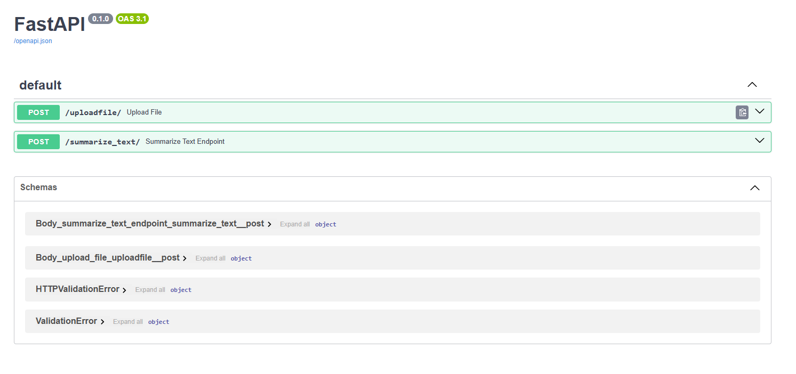
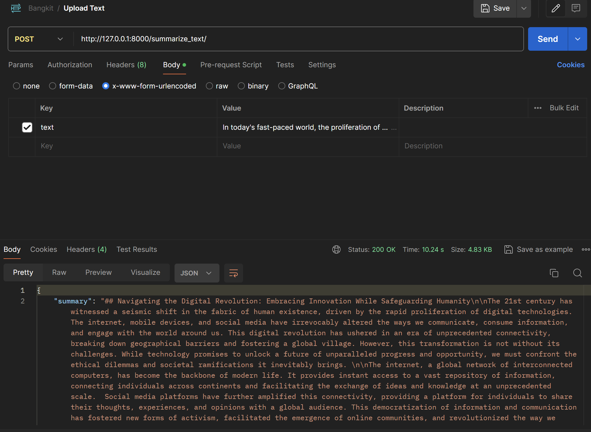
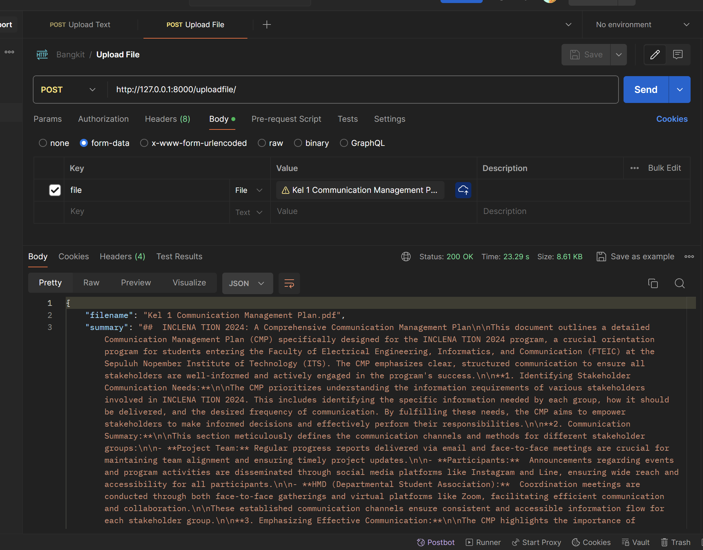

## Run
```py
uvicorn app.main:app --reload
```

## FastAPI Docs
<p align="center">
    

## Endpoint Testing
- **/summarize_text**
<p align="center">
    

- **/uploadfile**
<p align="center">
    
